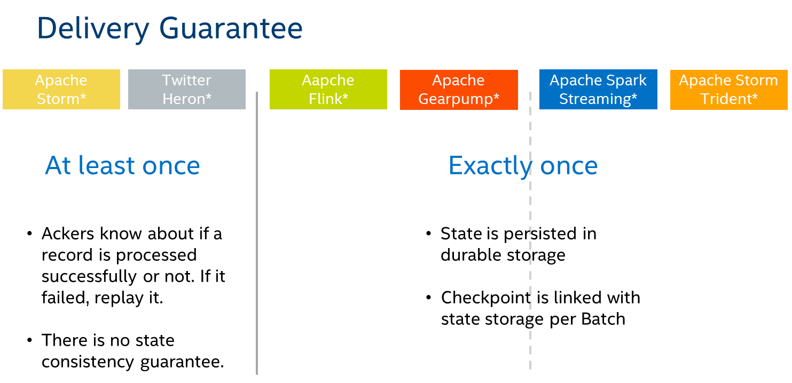

# Delivery Guarantee

Then let’s talk about message delivery. Here we have three semantics:

## At Most Once
At most once delivery means that for each message handed to the mechanism, that message is delivered zero or one times, so messages may be lost. 

## At Least Once
At least once delivery means that for each message handed to the mechanism potentially multiple attempts are made at delivering it, such that at least one succeeds. Messages may be duplicated but not lost. 

## Exactly once
Exactly once delivery means that for each message handed to the mechanism exactly one delivery is made to the recipient, the message can neither be lost nor duplicated.


Storm and heron can only achieve at least once, let’s say some operator successfully processed the message and ack it but that message is eventually failed. So the message will be replayed and the operator will process that message again, which finally cause the incorrect result. 

While the other four engine can achieve exactly once semantics.
