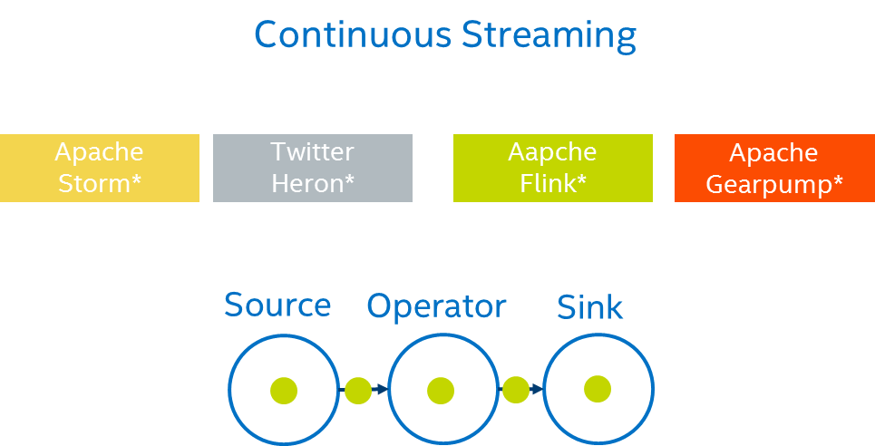
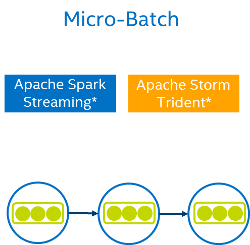

## Execution Model
In terms of execution model, we divide all the streaming system into two categories.

# Continuous Streaming
The first one is the native streaming model, it means all incoming messages are processed as they arrive, one by one.

# Micro-batching
The second one is called micro-batching, which batches up events that arrive within a short time and process the micro-batch once at a time. 

