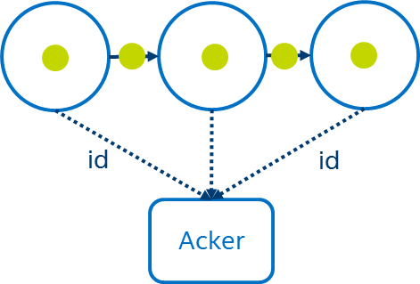
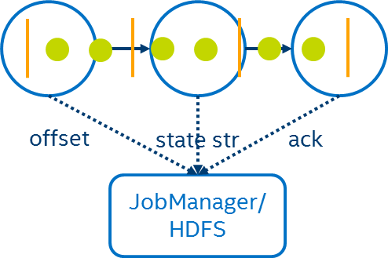
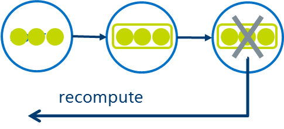

# Fault Tolerance Mechanism

# Storm

Strom will track each individual record as it moves through the system, when a task processed a record, it will acknowledge to some special tasks called Acker.  The acker maintains the ack for each record, if there is some ack time out then Strom know the corresponding message is lost and it will replay the message.

# Heron
Heron maintains the same acknowledgement mechanism as Storm but improves on the efficiency of record replay (and thus recovery time and overall throughput).

# Flink

For flink, it will insert some system-level barrier event into the data streams instead of tracking each individual message. When the operator received these barrier, a checkpoint will be trigered. Here all computations between two checkpoints can either succeed or fail as a whole, once all data sinks have received the barriers, the current checkpoint will be marked as finished. When failure happens, the framework can just recover from the latest checkpoint. 

# Spark Streaming

# Storm Trident

# Gearpump